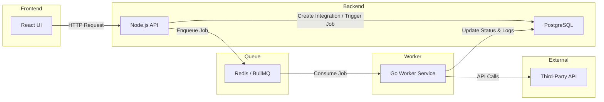

# SyncForge

A full-stack platform for managing third-party API integrations with asynchronous job processing.

## Tech Stack

- React (TypeScript)
- Node.js (API)
- Go (worker)
- Redis (queue)
- PostgreSQL

## Architecture (WIP)

