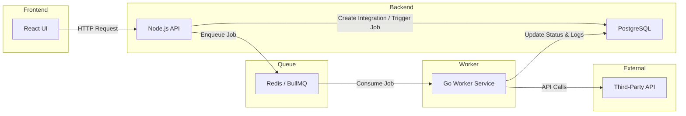

# SyncForge

A full-stack platform for managing third-party API integrations with asynchronous job processing.

## Environment Setup

- Copy `.env.example` to `.env` in the repo root for Docker Compose config.
- Copy `apps/api/.env.example` to `apps/api/.env` for local API runs.
- Copy `apps/worker/.env.example` to `apps/worker/.env` for local worker runs.
- Copy `apps/web/.env.example` to `apps/web/.env` for local web runs.

Required security variable:

- `API_ENCRYPTION_KEY` (used to encrypt `integrations.api_key` via pgcrypto)

Start the stack with:

```bash
docker compose up -d --build
```

## Tech Stack

- React (TypeScript)
- Node.js (API)
- Go (worker)
- Redis (queue)
- PostgreSQL

## Architecture (WIP)


